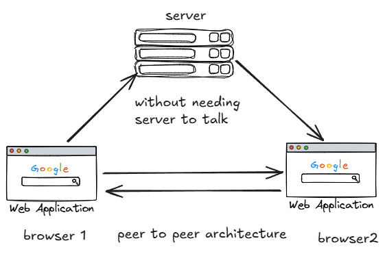
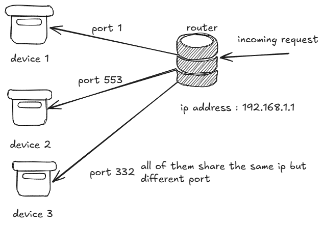
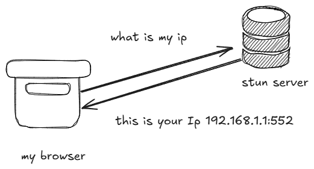

# A project implementation of webRtc 
## A real time video and voice communication protocol 
a common example of webrtc is zoom and google meet , microsoft team 

the architecture we are using today was used in 2010 and 2012 but it creates the basic version and makes a foundation for learning the real time communication 

We will build peer to peer application 

-Webrtc the only protocol that lets you do real time communication from inside a browser
-HRS => 10s delay => best for cricket matches for prime quality
-WebRTC => 0.1 s delay for => meet/omegle

  

>[!Note]
>But you still need the server to know the address of the person before they connect directly to each other , so you need the central server, like a websocket server. Like you need a phone number of friend to dial and connect to your friend. In this case the phone number is ip address through the telecomm provide i.e. server in this case.

The server is called the signaling server for bootstrapin the communication

### Stun (Session transversial utilities for NAT)

Network address translation(NAT) is for distrubuting the ip from router to the device connected via port 

** Stun gives you the publically accessible IP's. It shows you how the world sees you **

