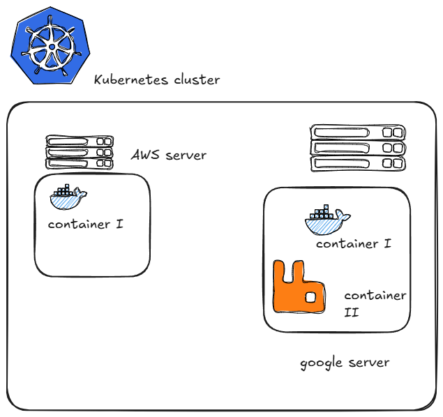
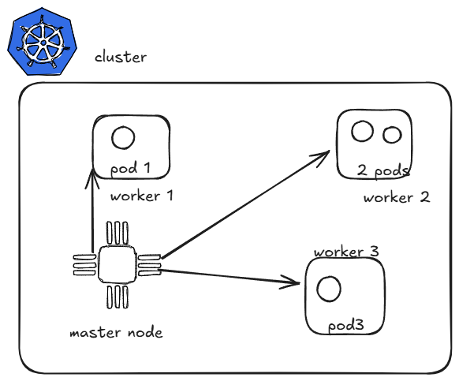
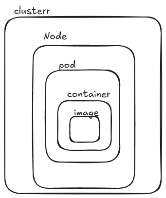

# Practical Implementation of kubernetes

In a cloud native fashion you deploy a container in cloud server rather than natively installing the application inside server. In such case, container solves the problem of having to install environment and dependencies each time when you move from one cloud to another. This makes the application depencdency indepent.

## Container Orchestration
Orchestration means to manage different things simultaniously. Container orchestration means , having to manage different containers simultaneously.Incase if the container goes down in any case, the developer needs to run the 'docker run command' if any container goes down in cluster.

An application contains container of different application such as for postgres database, Mongodb for nosql , redis for caching, kafka for high throughput of data etc.

This is where comes Kubernetes comes.
### Kubernetes 
Kubernetes is a container orchestration engine , which lets you create, delete and update containers. 
1. If you want to move from AWS to GCP viceversa
2. If don't worry about patching, want sombody to look at your resources all the time, incase if the container goes down you want sombody to autoheal.
3. If you want want a dashboard of want the container is doing or want to autoscale to some extent, like load balancing.

the thing that master node starts is a called pod,

![Note]
>pod is not a worker neither a container as a single pod can run many containers.

Here what a typical architecture looks like in micro detail. 

Here was what the subset looks like 

