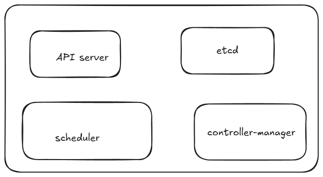
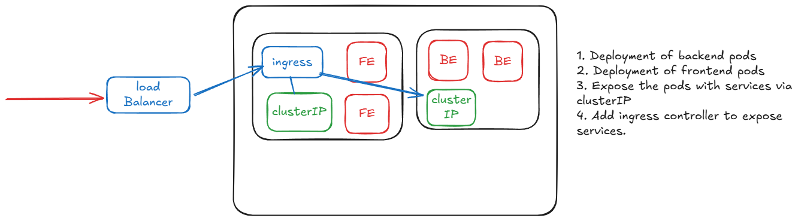

# Practical Implementation of kubernetes

In a cloud native fashion you deploy a container in cloud server rather than natively installing the application inside server. In such case, container solves the problem of having to install environment and dependencies each time when you move from one cloud to another. This makes the application depencdency indepent.


## Container Orchestration
Orchestration means to manage different things simultaniously. Container orchestration means , having to manage different containers simultaneously.Incase if the container goes down in any case, the developer needs to run the 'docker run command' if any container goes down in cluster.

An application contains container of different application such as for postgres database, Mongodb for nosql , redis for caching, kafka for high throughput of data etc.

This is where comes Kubernetes comes.
### Kubernetes 
Kubernetes is a container orchestration engine , which lets you create, delete and update containers. 
1. If you want to move from AWS to GCP viceversa
2. If don't worry about patching, want sombody to look at your resources all the time, incase if the container goes down you want sombody to autoheal.
3. If you want want a dashboard of want the container is doing or want to autoscale to some extent, like load balancing.


the thing that master node starts is a called pod,

>[!Note]
>pod is not a worker not a container as a single pod can run many containers.Master node is itself a EC2 instance and other worker nodes are EC2 instance as well.

Here what a typical architecture looks like in micro detail. 


Here was what the subset looks like 


## Architecture inside master node
1. Api Server : this where the developer sends HTTP request. The API server exposes http to either start container. It checks if the request sent by developer is authenticated and after authentication , it sends the request to etcd. 
2. Ectd : is a distrubted key-value paid distributed database. If there is multiple master nodes, this database is shared among those multiple master node.
3. Kube scheduler : schedules the job for certain pode in the cluster, finds node for running the container.
4. Controller manger : runs a bunch of controllers which inturns run infinite loop , which checks if something needs to be done.



## Architecture of worker node
1. Kubelets : that checks the request from api server from the master node.
2. Kube-proxy : which handles how you can send http request to the abstraction to container.

```bash
## to create a local container
kind create cluster --name local

```

To delete a node
```bash
kind delete cluster -n local
```
You can also create cluster from a yml file

```bash
kind create cluster --config <cluster.yml> --name local 

```
all the credential for cluster are stored in ~/.kube/config
inorder to send your credential along with the http request , you need to use kubectl.

```bash

kubctl get nodes
kubectl get nodes --v-8
kubectl get pods #gets the current pods running 
kubectl run nginx --image=nginx --port=80 #starts a pod
kubectl logs nginx # to check the logs if pod is running
kubectl describe pod nginx
kubectl delete pod nginx # deletes the pod
kubectl apply -f manifest.yml #to apply the config fi;e 
```

things learnt
---
cluster
node
pod
container
image

things learnt to left
---
Deployment
replicaSet
services
ingress
configmaps
---

### Deployment
A Deployment is a higher level abstraction that manages a set of pods and provides declarative updates to them. If offers features like scaling, rolling updates adn rollback capabilites. If you have run 10 pods , you have to run kubectl run multiple times.It lets you roll back incase there is a failure in the pods. There is also a deployment controller in the master node.
- A pod is a smalleest object in kubernetes. It represents a single instance of running object in your cluster, typically containing one or more container
- A deployment is higher level controller that manages a set of identical pods.

```bash
kubectl create deployment <deployment_name> --image=nginx --replicas=4 # creates a nginx pod with four replica set
kubectl get deployment
```

### Replicasets
Deployment => replicaset => pods
- A deployment does not actually create pods but a replicaset does. A deployment is responsible for creating a stable set of replcaset in the cluster.
```bash
kubectl get rs # to get the replicaset
kubectl apply -f replicaset.yml 
kubectl delete rs nginx-replicaset
kubectl logs <deployment_name>
```
incase if you make changes in the existing deployment by tampering with container image , which it is already running , then it creates another replicaset , that means you have two replicaset. If something goes wrong with newly formed replicaset then the old replicaset is still left to roll back upon.

### services

- a service is an abstraction that defines a logical set of pods a policy by which you can access them. It is a way to expose applications running on a set of pods as a network service. 


- cluster IP => exposes the cluster through a   clusterIP
- NodePort exposes the node to outside world
- LoadBalancer : balances the load of incoming services to different nods, it will be different from the cluster, even if you delete the cluster, it does not get deleted.
>[!Note]
>you need to map the port before you visit the port of the node. 


----
things left to learn
1. Namespaces
2. Ingress
3. Ingress Controller
    - nginx
    - traefik : another type of ingress controller
4. configMaps
5. secrets
----
1. cert management
2. volumes and persistant volumes
3. resource management


----

1. HPA - horizontal pod scaling
2. Node autoscaling
3. Labs to add k8s to real codebase

----

### Ingress
The problem with load balancing using services is that it cannot do rate limiting. YOu want to have a single load balancer, such that even if the path is differerent or domain you reroute the path accordingly to the respective pod. This is where ingress controller comes. It is different from kubernetes abstraction and ingress controller doesn't come in default with kubernetes cluster.

### Namespaces
lets you divide clusters betweeen multiple users and teams.Namespaces are meant to be used in environments where multiple users are spead across mutliple teams or projects


```bash
kubectl create namespace backend--tech
kubectl get namespaces

kubectl get pods -n my-namespaces 
kubectl get pods --all-namespaces

```
you can add namespace to a deployment by adding the attirbute namespace in the configuration file

to intall nginx you need to install helm package. 

```bash
winget install Helm.Helm

helm repo add ingress-nginx https://kubernetes.github.io/ingress-nginx
helm repo update
helm install nginx-ingress ingress-nginx/ingress-nginx \
  --namespace ingress-nginx \
  --create-namespace

```



inorder to tell to which services should one ingress should route to we need to 

### secrets and configmaps

kubernetes suggest some standard configuration practices
1. never create pod without deployment
2. write your configuration with Yaml file
3. configuration file should be stored in version control before they are pushed to the cluster.

1. configmaps: are designed to store non-sensitive configuration data such as configuration files, environment variables or command-line arguments
2. secrets : are designed to store sensitive information such as passwords , Oauth , tokens and ssh keys. You have to encode it in base64, since it is volatile(you need to update it frequently).You store in final secrets in cloud provider vaults

