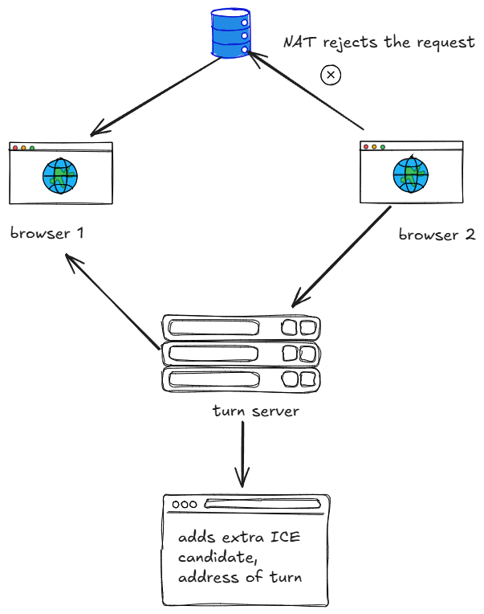
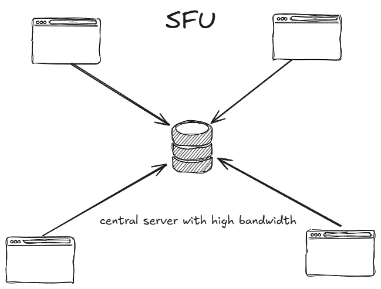
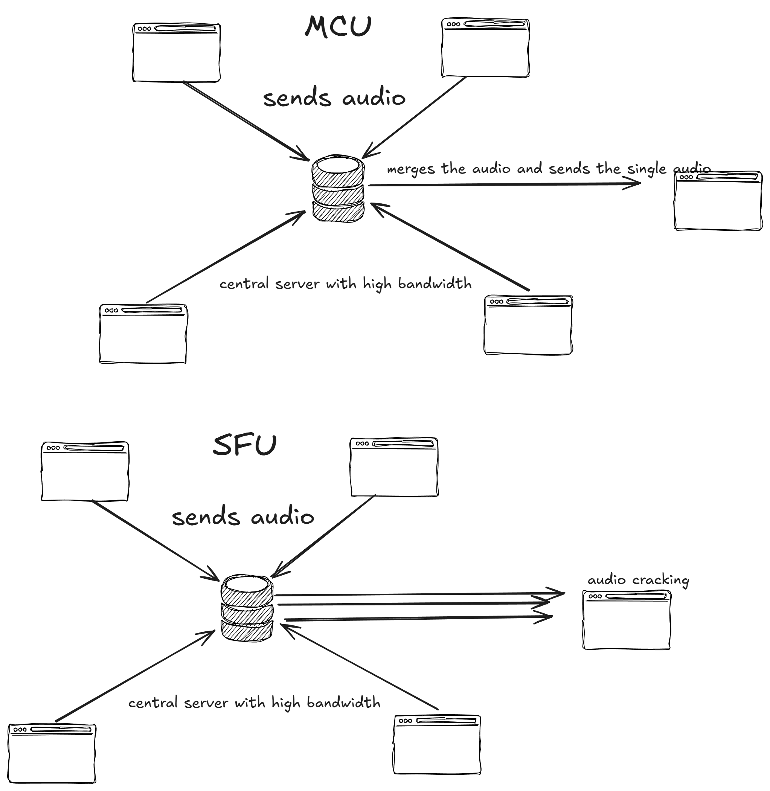

# A project implementation of webRtc 
## A real time video and voice communication protocol 
a common example of webrtc is zoom and google meet , microsoft team 

the architecture we are using today was used in 2010 and 2012 but it creates the basic version and makes a foundation for learning the real time communication 

We will build peer to peer application 

-Webrtc the only protocol that lets you do real time communication from inside a browser
-HRS => 10s delay => best for cricket matches for prime quality
-WebRTC => 0.1 s delay for => meet/omegle

  

>[!Note]
>But you still need the server to know the address of the person before they connect directly to each other , so you need the central server, like a websocket server. Like you need a phone number of friend to dial and connect to your friend. In this case the phone number is ip address through the telecomm provide i.e. server in this case.

The server is called the signaling server for bootstrapin the communication

### Stun (Session transversial utilities for NAT)

Network address translation(NAT) is for distrubuting the ip from router to the device connected via port 


**Stun gives you the publically accessible IP's. It shows you how the world sees you**


Now the full architecture somewhat looks like this, where clients pings its addresss and port form stun, sends it to the signaling server and receieves the incoming client's ip address for further P2P connection


## Ice candidates
The priority of client of people to which one can get connected. Tries to connect with higher priority candidates. Interactive connectivity establishment(ICE) candiadates are potentioal networking endpoints that webRTC uses to esablish connection betweeen peers. Each candidate represents a possible method for two devices (peers) to communicate, usually in the context of real time application like video calls, voice calls or peer-to-peer data sharing.

if two friends are trying to connect from the same hostel or building , then they can connect via private router ice candidates

if two people are trying to connect to each other from different countries, they they would probably connect via public ip

### Turn server

![Note]
>A lot of times your network does not allow media to come in from browser 2.The browser questions why is the ICE candidate coming from stern but media from differnt browser. This depends on how restrictive your network is 

Since ice candidate is discovered by the stun server , your network media might block the incoming dat from browser 2 and only allow it from the stun server

So if the NAT is very restrictive , which is where the turn server comes into the picture. 
It give you a bunch of extra candidate.

this where the architecture turns from p2p to client server. It is fallback if you are not able to talk back. Do we need it today? no , but do you need it YES.The browser recives both ice candidate and media from the turn server 


### Offer
the process of the first browser (the initial connection) sending their ice candidates to the other side.

### Answer
The other side returning their ice candidates is called the answer


### SDP-Session description protocol
A single file contains all your ice candidates
1. ice candidates
2. What media you want to send, what protocols you've used to encode the media. 
This is the file that is sent in the offer and received in the answer

### RTC Peer Connection (pc, peer connection)
this is a class that the browser provides you with which gives  you access to the sdp, lets you create answers/offers lets you send media. 
The class hides all the complexity of webrtc from the developer


## Implementation 
1. Nodjs for signaling server, which will be a websocket serer that supports 3 types of messages
-createOffer
-create Answer 
-addiceCandidate
2. React + peer Connectionobject on the frontend

![Note]
>In case of call of more than 5 people, the browser and cpu cannot handle the request. In such case the P2P architecture fails.

# Connecting two sides
the steps to create a webrtc connection betweeen 2 sides inclues-
1. Browser creates an RTCpeerConnection
2. Browser 1 creates an offer
3. Browser 1 sets the local description to the offer
4. Browser 1 sends the offer through signaling server
5. Browser 2 recieves the offer from signaling server
6. browser 2 sets the remote description to the offer
7. browser 2 creates an answer
8. browser 2 sends the answer to the other side from the signaling server
10. Browser 1 recieves the answer and sets the remote description.

```javascript
// in browser 1
const pc = new RTCPeerConnection();
const offer = await pc.createoffer();
pc.setLocalDescription(offer)
pc.setRemoteDescription(answer)
// the offer to browser2
//in browser 2
const pc2= new RTCPeerConnection();
pc2.setRemoteDescription(offer)
const answer = await pc.createAnswer();
pc.setLocalDescription(answer)
```
after establishing connection 
we need:
- ask for persmission for camera and mic
- their audio and video streams
- pc.addTrack(video)
- pc.onTrack = (track) => {document.getElementById('video').changeVideo=track}

In such case there is a central server , the browser sends the video stream to that central server like EC2 or google server.

this type of architecture is called SFU(selective forward unit)

Pion is common example for implemnetation of webRTC protocol in web server in golang
Problem : audio , you need to recieve alot of audio from central server which recieves from diffrent browser and causes cracking

there come the MCU

you don't need to merge every audio , you merge the top three loudest audio.

SFU => forward packets  => doesn't need to decode video 
MCU => does need to decode the video (ffmped) => merge the data  => re -encode the data
which is MCU is very expensive
open source SFU -- janus, jitsy, media soup , pion
